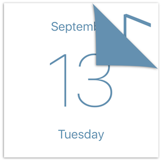
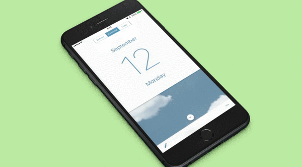

# TKCalendarView

The page curl animation calendar.  Inspired by 『[君の名は｡](http://www.kiminona.com/index.html)』

## About

A calendar app used in the movie called 『[君の名は｡](http://www.kiminona.com/index.html)』

Swipe to change date with page curl animation.
Written in Swift 3.

## Preview

## Requirements
iOS 10+

XCode 8.0+

Swift 3.0+

## Installation
### Cocoapods

	pod 'TKCalendarView'

### Manually
Drag `TKCalendarView.swift` , `TKDatePageView.swift` into your project.

## Usage

### Use Interface Builder
Add a `UIView` and change class to `TKCalendarView`. That's all.

### Or use code

	let calendar = TKCalendarView(frame: CGRect(x: 0, y: 0, width: 320, height: 320))
	calendar.delegate = self
    view.addSubview(calendar)
    

### Delegate 

When date changed `TKCalendarView` will call this delegate.

	func calendar(calendar: TKCalendarView, dateChanged date: Date) {
        print(date)
    }

## Customization

Here is a list of customizable behaviors:

	var color
	var dayFont
	var monthFont
	var weekFont
	var calendar

## License
TKCalendarView is available under the MIT license. See the LICENSE file for more info.
